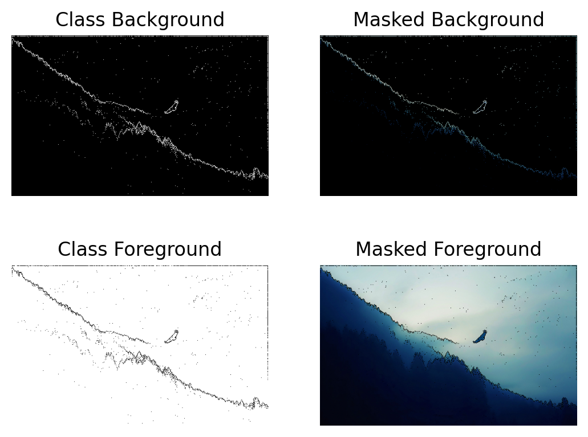
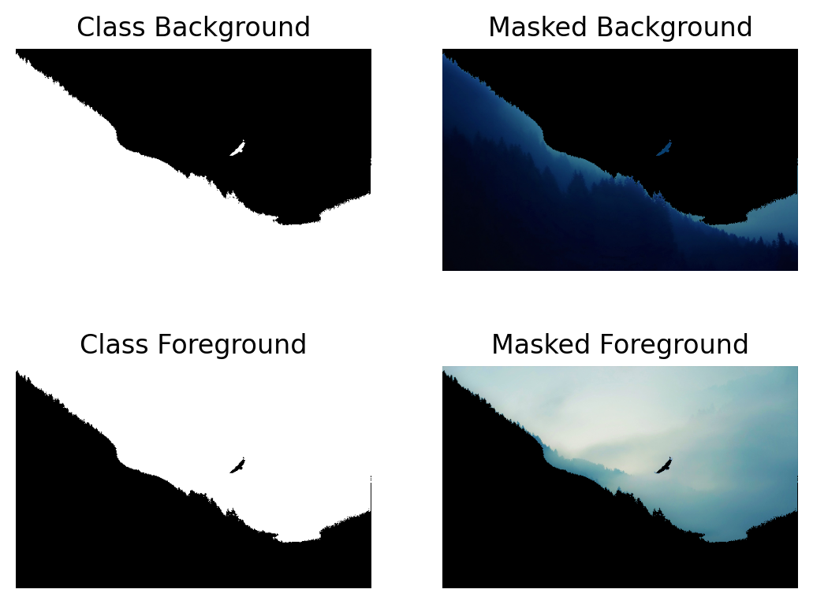

# ImageSegmentation
 Image Segmentation Algorithms and Models

# GUI

 - GUI built using streamlit
 - To use app locally,
    - Clone the repo and run [StartUI.sh](StartUI.sh) to view the app on your browser!
 - App is also hosted remotely on my Common-Host-App,
    - [Heroku](https://infinityjoker-apps.herokuapp.com/)
    - [Streamlit](https://kausikn-commonhostapp-app-zxfv4q.streamlit.app/)
 - To use the app on my Common-Host-App,
    - Choose a project to load and click load and deploy.
    - Then go ahead and use the app! 😃
    - If you want to change to another app, simply click on View Other Projects in top left and choose any other project and load and deploy.

# Sample Image

# Non-AI Methods
Background-Foreground Segmentation
 - Histogram
    - Mean-Max
        
 - Filters
    - Laplace
        
 - Cluster
    - KMeans
        

# AI Methods
 - In Dev, stay tuned :-)